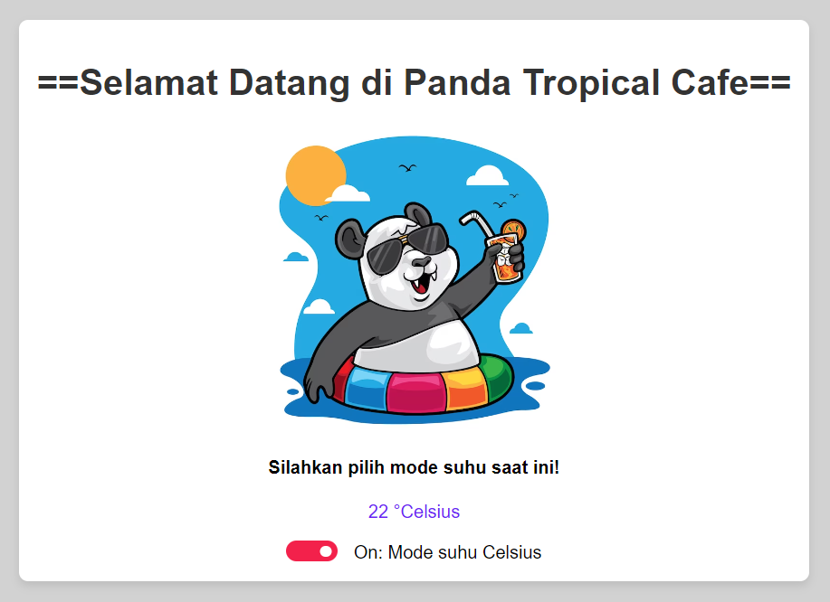

# git-exercises

Latihan Materi Intro Javacript, Conditional, Looping dan Function - 16 s.d 17 November 2023 (kelas kak Gio)  
Keterangan:  

- File index.js : kumpulan source code js dari semua tugas intro Javascript (karena di awal running js di online compiler)  
- File soal-teori-intro.md : Jawaban soal teori materi intro Javascript  
- File latihan-intro-javacsript.md: Jawaban soal seputar latihan awal console.log/alert  
- File latihan-conditional.md : Jawaban soal materi conditional intro Javascript  
- File latihan-looping.md : Jawaban soal materi looping intro Javascript  
- File soal-teori-function.md: Jawaban soal teori function  
- File info-pembeli.html : tampilan soal 1 dari materi function
- File konversi-suhu.html : tampilan soal 2 dari materi function
- File umur-kucing.html : tampilan soal 3 dari materi function
- File lowercase.html: tampilan soal 4 dari materi function

- TUGAS BASIC FUNCTION  

- Soal Nomor 5 untuk buat Tampilan Soal Nomor 1 - Info Pembeli (info-pembeli.html):  

- Soal Nomor 5 untuk buat Tampilan Soal Nomor 2 - Konversi Suhu (konversi-suhu.html):

- Soal Nomor 5 untuk buat Tampilan Soal Nomor 3 - Umur Kucing (umur-kucing.html):  

- Soal Nomor 5 untuk buat Tampilan Soal Nomor 4 - Lowercase (lowercase.html):  

